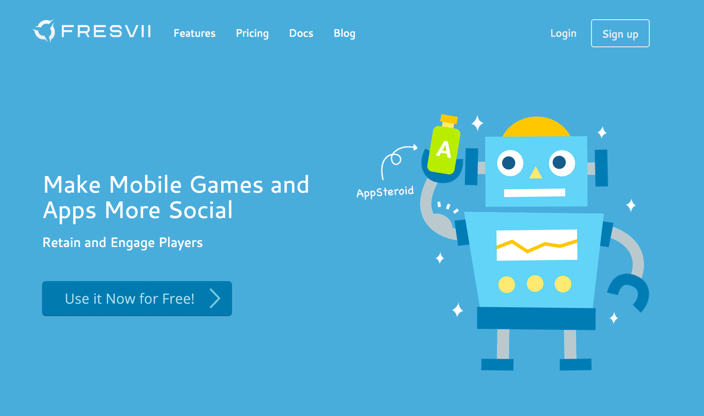
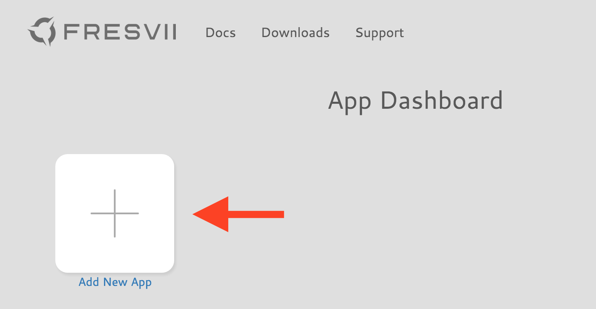
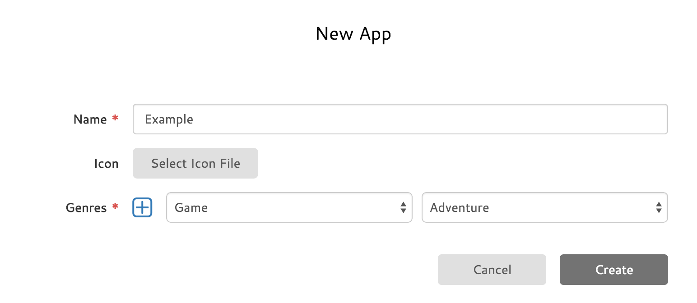
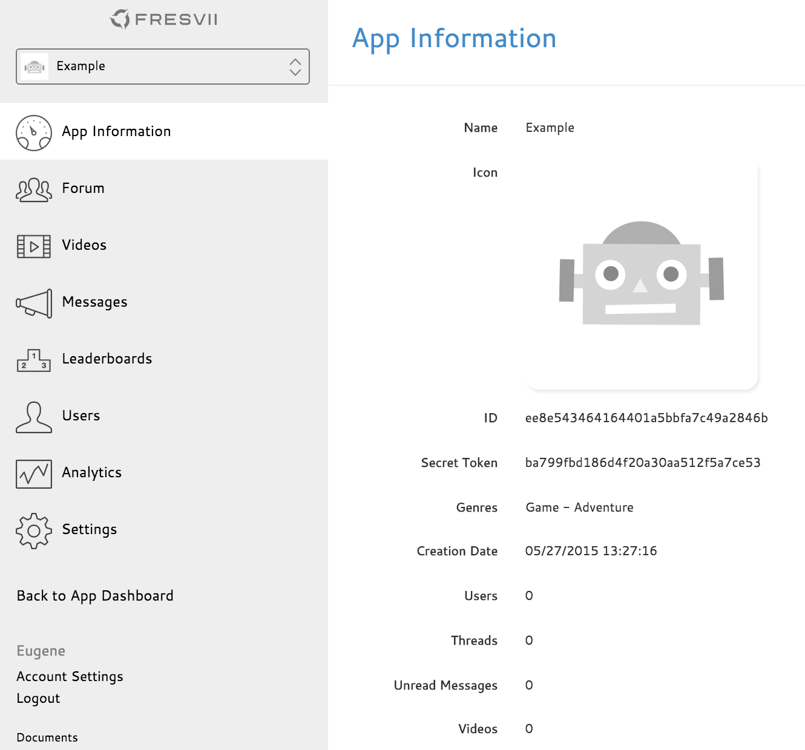

# App Registration on web console

----------

Before using the AppSteroid SDK, you need to create an account, login and register your application on the [Fresvii Website](https://fresvii.com/).

## Access [Fresvii Website](https://fresvii.com/)
1. Access the [Fresvii website](https://fresvii.com/) for sign up.

Select sign up on the right top corner.

## Create Account
1. Enter your user name, email address, unique password and organization to login.

## Create New Application
1. Select "Add New App" on the top page.

2. Enter a name for the application, select an icon and genre.

3. You should see the Dashboard after adding your App.
The ID and secret key indicated on this page is used on [GetStarted](GetStarted.md).

4. You have completed your initial setup.
You can check the user information at the top of the dashboard anytime.