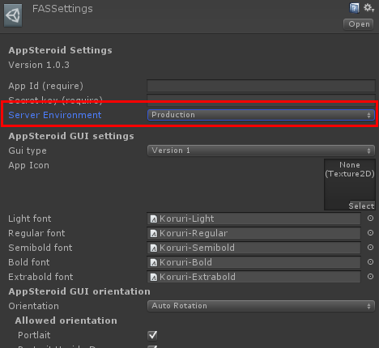

# About Development Mode

---

## Description
All applications on AppSteroid have two data areas. One for development and other for production.  When you are operating your application on development mode, all datas will be stored on a different database from production where end-users would not have any access to it. (They will not see any text, images posted on development mode.) This allow you to test and develop your application without messing up your production data.

### Select Development Mode

Go to Unity Menu → Fresvii → FASSettings, and select Production or Development for the "server environment" on the inspector.

**※Important Note** All data managed on the web console is production data.
**※Important Note** By switching development mode, login user information will be discard.

## About Types of APNs Certificate

APNs Certificate also have two different types, Development and Production. (Please check the iOS Dev Center for more information).

You can register either type of certificate, development or production, on the Web Console.  The certificate type registered on the web console and the Provisioning Profile type used on build **Must Match** to make it work.  (e.g. if the APNs on console is development, Provisioning Profile used for build must be development.)

If you call the method without the certificate type argument, it will consider "development" on development mode and "production" on production mode.  If the certificate type does not match, an error will be returned.

### Notes on Certificate Registration

If you Register Production APNs certificate for development mode environment on the Web Console and launch the App on Xcode with the Debug setting (Meaning Provisioning Profile is on development), the SDK will try to register the device token as Development automatically.  This will cause an error since the certificate registered on the server (Production) and the environment noticed on device token registration (Development) does not match.

#### Simplest way for setup

1. Setup APNs Certificate for both Production and Development on the Web Console.
2. On development, build with Provisioning Profile(Development) and execute as "server environment" = "Development".
3. On production, build with Provisioning Profile(Distribution) and process as "server environment" = "Production".

We highly recommend to use the settings above.