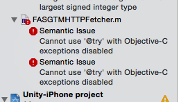
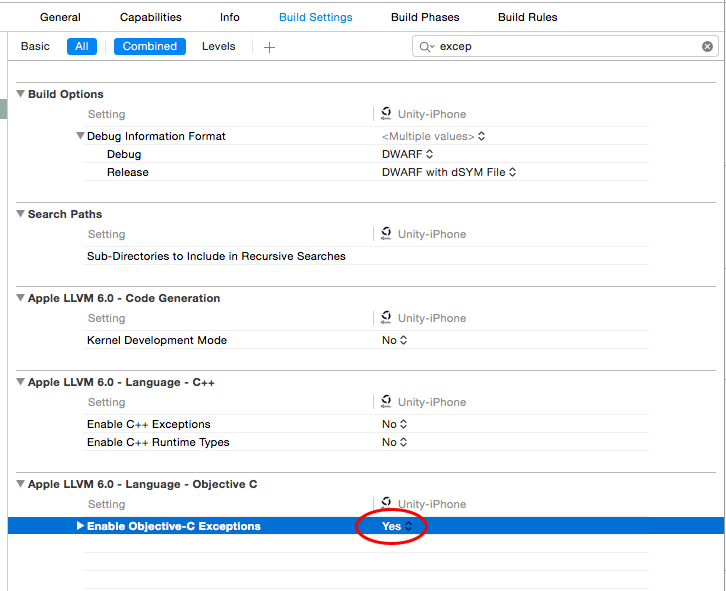
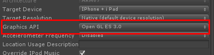
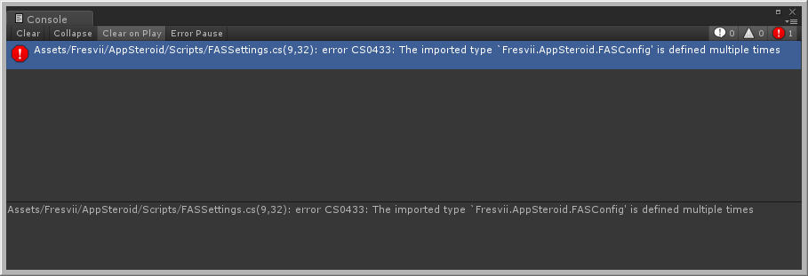

# Frequently asked questions about AppSteroid for Unity #

----------

#### Which versions of Unity are supported?

The supported versions of Unity API is 4.7.1. Unity Pro is not required.
If you are using Unity 5, please use version 5.2.4 or higher. Please use AppSteroid SDK package for Unity 5.3.​x, if Unity 5.3.x is been used. 04/27/2016

##### Supported version of Unity in AppSteroid v1.2.0
|Unity Version|iOS|Android|
|-----|-----|-----|
|4.7.1|○|○|
|5.2.4|○|○|
|5.3.5|○|○|

#### What is the supported version of the platform?
iOS 8.1 and higher. Android 4.0.4 and higher is recommended.
We will be supporting Android 6.0 Marshmallow soon. 04/27/2016

#### What do I need to do to update the AppSteroid SDK?
Please check [Updating the SDK](Updating AppSteroidSDK.md) for instructions.

#### GUI texture looks blurry on the screen. How can I fix it?

Go to "QualitySettings" on Unity and change the Texture Quality to Full Res.

#### What should I do when an error occurs after installing the updated AppSteroid SDK package?

When an error occurs right after the installation, existing old files or duplicated classes may be causing the error. Please delete the Assets/Fresvii folder and reinstall the latest AppSteroid SDK package.

**Your previous settings for FASSetting will be lost when deleting the Assets/Fresvii folder.** So, please save your AppID, Secret key or GCM Project Number on a note. Also, you can save the `FASSettings.asset` file on the side and save it over the new file after installing the latest SDK package.

#### Error occurs on iOS build. What should I do?

If you see an error on `FASGTMHTPFetcher` like the following image, Set the `Enable Objective-C Exception` to `YES`.  Type exception in search box to find it.

#### Play video is alway black after the video capture on iOS. Any solution?

AppSteroid currently support Open GL ES 3.0 for recording function.
Go to Player Setting -> Other Settings and change the Graphics API to Open GL ES 3.0.

- Unity 4.6.7

- Unity 5.1.2

In the generated Xcode project, in GLESHelper. mm, find CreateSystemRenderingSurfaceGLES, and change:

    [NSNumber numberWithBool:FALSE], kEAGLDrawablePropertyRetainedBacking,

to:

    [NSNumber numberWithBool:TRUE], kEAGLDrawablePropertyRetainedBacking,

#### Screen transition is very slow when loading a new scene. Any solution to speed it up?

AppSteroid for Unity do provide a method to speed up scene loading.  Please check [FASGui.ShowGUIWithLogin](https://github.com/fresvii/appsteroid-sdk-unity-documents/blob/master/en/Specs/Spec-FASGui.md#FASGui.ShowGUIWithLogin) for detail.
Also, if you are using Unity pro, you can speed up screen transition with asynchronous process.

#### Error occurs right after installing the AppSteroid package. What should I do? 

**Case 1.** AppSteroid supports iOS and Android platform. If your are selecting any other platform besides iOS or Android, an error may occur.  Select iOS or Android after checking the build settings to avoid any error.

**Case 2.** If you see either of these two error, `'Fresvii.AppSteroid.FASConfig' is defined multiple times` or `'FASConfig' could not be found.`, it is likely that you have installed the AppSteroid SDK that does not match with your Unity version. Please reinstall either of the correct package, AppSteroid SDK for Unity4.6 or AppSteroid SDK for Unity 5.

**Case 3.** If you see an error indicating that there is a missing file or class does not exist, you may have failed importing the package and the files. Please try reinstalling it again.

Please check the document, [SDK Update](Updating AppSteroidSDK.md), for error involved on updating the SDK. 

#### <a name="apsanddatabase">- Where and How will the data be stored?</a>
Since AppSteroid is operated on AWS, all data created through the API calls will be managed on the AWS database.  We may cache data locally for non connected use of the AppSteroid platform, or to improve performance. Part of these persistence user data can be exported from the Web Console.

All AppSteroid user data is basically managed on the same database, and individual data can be distinguish by linking them to the application or the user. If you want the database to be private, we also offer a separate plan to support.

#### <a name="commonsystem">- If the system is going to co-exist with our database, how should it be done?</a>
All AppSteroid user data are ensured to be unique and also can be identified by the ID.  If users are managed on your system, you must have a solution to relate your own user data with the AppSteroid user data.  If you are using any other third party services, we recommend you to treat one of the user data as a master, and link the other user data to it.

The data used in each service should be held by each service.  If you want to link the data between each services, you can preform it by calling the API provided by the service from the app. We currently do not provide any interface to communicate directly between the servers.

#### <a name="loadtest">- How much load can it handle？</a>
All data related to feature provided by AppSteroid, such as recorded videos, text logs and more, can be stored unlimitedly.
It is basically same as any other WEB service for perfomance on API responses. The performance may drop when there are rush on access, however, we put our best effort to prevent it by enhancing the server at high loading.  Up to date, we never had a server down or big issue on performance drop. (September 23, 2015)

#### - User login doesn't work on iOS device, after switching the FASSettings' Server Environment.
This bug was found in v.1.0.8, when switching the FASSettings -> Server Environment between Development and Production.
The Bug was fixed in v.1.0.9. If switching the user ID per sever environment is necessary, please login to the previous server once, than switch the server environment and login.

#### - The following Exception has been output after launching the app on Android device. What should I do?
    NullReferenceException: Object reference not set to an instance of an object
    at Fresvii.AppSteroid.Services.NotificationService.Process () [0x00000] in <filename unknown>:0
    at Fresvii.AppSteroid.FASClient+<UpdateNotification>c__Iterator0.MoveNext () [0x00000] in <filename unknown>:0

This occurs when the app does not use push notification on Android, and when the `GCM Project Number`, `GCM Api key` under FASSetting is empty.  Since it does not effect the behavior of the SDK, please ignore the output message.  This will be fixed on ver 1.0.9.

#### The following Exception has been output. What should I do?
    NullReferenceException: WWW class has already been disposed.
    Fresvii.AppSteroid.Util.WWWRunner+<DoRequestCoroutine>c__Iterator1B.MoveNext ()

  This shows up when communication with the server has timed out.
Since it does not effect the behavior of the SDK, please ignore the output message.  This will also be fixed on ver 1.0.9.
  Also, if you do confirm a Timeout error, please check the network status around the execution environment.
  
#### Character corruption occur in another language. How do I fix it?
Error may occurred at the Unity import. Please process "Reimport All" and run the project.

#### Fresvii menu dosen't show up. How do I fix it?
When there is an error on Unity, or compiling did not preform correctly, the editor menu will not show up. 
Please solve the existing error in Unity.

#### The following error appears after the import.

    Assets/Fresvii/iTween/Plugins/iTween.cs(47,14): error CS0101: The namespace `global::' already contains a definition for `iTween'

If AppSteroid v1.0.9 and version below v1.0.9 is used, or iTween is been used, iTween maybe got imported duplicately. Delete the `Assets/Fresvii/iTween/Plugins/iTween.cs` file.

#### The following error occurs in Android build. How do I fix it?
    CommandInvokationFailure: Failed to re-package resources. See the Console for details.

Importing the asset may have failed. Right click the Unity Asset folder and select `Reimport All`.

#### How do I inhibit users to edit user name?
Preform the following 2 steps, and the end users will not be able to edit their user name.

1. **Inhibit user name generation and access to editing on AppSteroid**
 Go to App Settings on Fresvii Web Console, "Settings" -> "User Default Settings" -> "Disable User Name generation", and put a check in the box. This will disable user generation.

2. **Use the SDK API to generate/edit user name**
　Use the API below to "sign up with user name". Or, to change a existing user name, user "Edit login user information".
    - [Sign up with User name](https://github.com/fresvii/appsteroid-sdk-unity-documents/blob/master/en/Specs/Spec-FASUser.md#FASUser.SignUp)
    - [Edit login user information ](https://github.com/fresvii/appsteroid-sdk-unity-documents/blob/master/en/Specs/Spec-FASUser.md#fasuserpatchaccount)

Please check [this](https://github.com/fresvii/appsteroid-documents/blob/master/en/UserNameGeneration.md) document for user name generation.