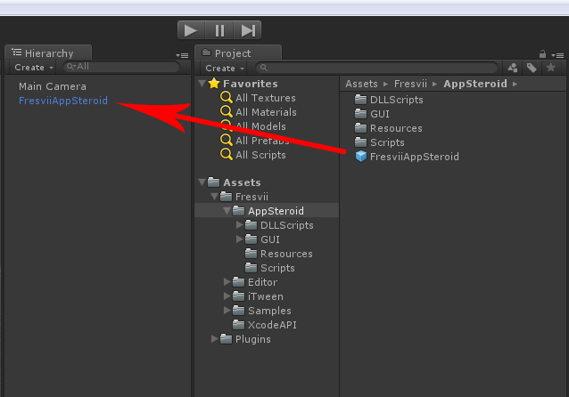
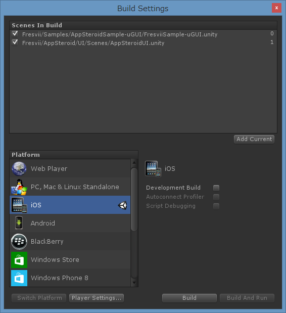
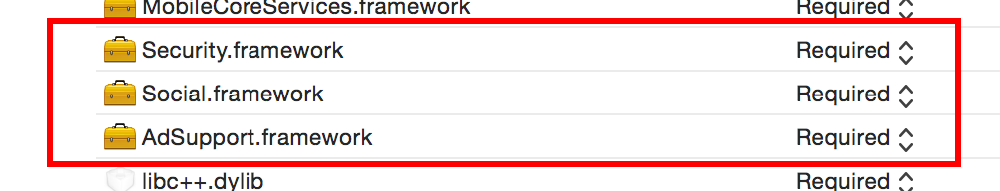
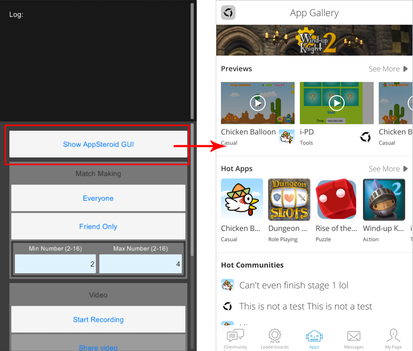

# Getting Started

----------

This document will walk you through the steps to initially install AppSteroid. For updating your current AppSteroid, please check [SDK Update](Updating AppSteroidSDK.md) for instruction.

1.  Import the Unity Package "appsteroid-unity-\*.\*.\*.unitypackage" on the AppSteroid. (Choose "Assets" > "Import Package" > "Custom Package...".)

2.  Lay out the AppSteroid prefab to the scene.

3.  Setup the following app information on the inspector. Select "Fresvii"->"FAS Settings" on the menu.
You can get the AppId and SecretKey on the Web Console. Please check the document, [Register your app on the WebConsole](AppRegistrationOnWebConsole.md) for details.

|Data|Type|Description|
|-------|------|-----|
|App Icon|Texture2D|Image of the app icon (Used in AppSteroid GUI) |
|Uuid|string|(Required) App ID of AppSteroid |
|Secret key|string|(Required) App secret key of AppSteroid |
|Server Environment| Production or Development | Select the server environment. You will have 2 environment on your choice, Production or Development.|

#### AppSteroid GUI settings
|Data|Type|Description|
|-------|------|-----|
|GUI type||Choose from Version1 / Legacy. Please note that Legacy will not be supported at the later update.|
|Light font||Light font|
|Regular font||Regular font|
|Semibold font||Semibold font|
|Bold font||Bold font|
|Extrabold font||Extrabold font|
|App Steroid GUI orientation||Set up device rotation of AppSteroid GUI |
|CSR|bool|Whether to use CSR Chat (Live Help, Customer Support) feature or not. |
|Log level|FASSettings.LogLevel|Log export level. Select from { Verbose, Warning, Error, None }. It will still export error log for `None` when there was an input omission for required parameter. |
|Auto relogin silently on resume|Whether to relogin or not when relaunching the app.|

#### Push notification
|Data|Type|Description|
|-------|------|-----|
|Enable|bool|Whether to use push notification or not |
|Register push request on start|bool|Whether to Automatically register push notification on initial boost or not. |

#### iOS Settings
|Data|Type|Description|
|-------|------|-----|
|APNS Certificate| Production or Development |Provisioning settings of APNS. When the Server Environment and APNS Certificate are both in Production and the build is in release, or, when the Server Environment and APNS Certificate are both in Development and the build is in debug, the device token for push notification will be registered.|
|Video feature|bool|Whether to use video record and share function or not. If you are going to use video record, select the Graphic API = Open GL ES 3.0 |

### Android Settings
|Data|Type|Description|
|-------|------|-----|
|GcmProjectId|string|Project ID when using the Google Cloud Messaging for Android service |
|Gcm Api Key|string|API key when using the Google Cloud Messaging for Android service |
|Notification small icon background|Color|Background color on the small icon for push notification (Android 5.0 and later)|
|Backup Api Key|string|API key to use Google BackupManager service. |
|Vibrate on push notification|bool|Whether to use vibration or not when receiving push notification.|
|GET_ACCOUNTS permission|bool|Check is required to use push notification for Android under 4.0.4. When it is checked, it asks to get user's google account. |

After setting up 1 through 3, you will be able to use the methods of the FAS class.

4. Add "AppSteroidGUI" scene on "Build Setting" and select iOS or Android for the platform.

5. Now, you should be able to show AppSteroidGUI using the sample code.  Check [Use Fresvii GUI](./Use Fresvii GUI.md) for detail.  
Once you succeeded showing the GUI on Unity editor, use the settings for each device and test it on iOS/Android.

----------

## Device Settings

### With iOS

User information is saved on keychain with AppSteroid for Unity in iOS.
Thus, when building with Xcode, open (Build Phases -> Link Binary With Libraries) and add "Security.framework".

Add "Social.framework" for video share feature.

Also, to use group conference feature, please follow the steps on "GroupConferenceGetStarted" and add `libc++.dylib`.

Set Objective-C Exceptions as YES.

----------

### With Android

#### AndroidManifest Setting

Please refer to "AndroidManifest Settings for Android".

#### Push Notification Icon Setting

Replace (Rewrite) "ic_stat_notify.png" and "ic_launcher_notify.png" which is inside Assets/Plugins/Android/res/drawable-*dpi folder, with the same name and same resolution.

"ic_stat_notify.png" will be the icon (small icon) used in notification on status bar.

"ic_launcher_notify.png" will be the launcher icon used in notification center.

---

## Feature List

Please refer to [this](FeatureList.md) document to check out the list of features for AppSteroid SDK.

## Show Sample GUI

Open the "FresviiSample-uGUI" scene to use the sample GUI.
Sample GUI is useful to understand implementation method for each feature. Refer to [this](FeatureList.md) document to check out the list of features for AppSteroid SDK.

No additional coding is required for executing the sample code.

Auto generate Android.manifest by pressing "Generate Android.manifest". To overwrite the Android.manifest, duplicate the existing Android.manifest first, and change the name to take a backup, then it will automatically create another new Android.manifest. If you don't want to generate the Android.manifest automatically, please refer to "[Unity-Android]Setting Up AndroidManifest" and edit it manually.

Click　“Show AppSteroid GUI” to show the AppSteroid GUI.

