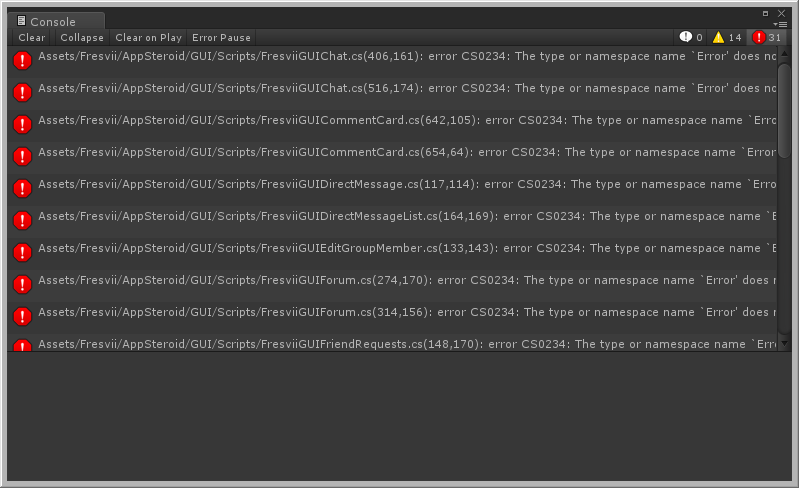

# Updating AppSteroid for Unity

----------

This document will walk you thorough the steps to update AppSteroid. If it's your first time installing the SDK, please check out the document, [GetStarted](GetStarted.md).

## Standard Update
1. **Please backup your projects before going through this process.**
2. Download the package from [Fresvii SDK Downloads](https://fresvii.com/downloads).
3. Import all the package files. If you did not encounter to any errors, your update was successfully completed.

## Steps to Update from Unity 4.6.x to Unity 5.x.x
1. **Please backup your projects before going through this process.**
2. Open and update the project on Unity 5. Since the AppSteroid SDK for Unity 4.6 still applies to the project at this point, you have a good chance to encounter an error after import. Even if you do not encounter any errors, please follow these steps to apply AppSteroid SDK for Unity 5 to your project.
3. Copy and save the `Assets/Fresvii/AppSteroid/Resources/FASSettings.asset` file anywhere beside `Assets/Fresvii` folder. `FASSettings.asset` file stores the setting information for AppSteroid such as, AppID and Secret Key.  Note: Do not get mixed up with `Assets/Fresvii/AppSteroid/Scripts/FASSettings.cs` file.
4. Delete `Assets/Fresvii` folder.
5. Delete any of the following files found in the `Assets/Plugins` folder: `Android/AppSteroidAndroid.dll`, `Android/AppSteroidWithVoiceChatAndroid.dll`, `iOS/AppSteroidIOS.dll`, `iOS/AppSteroidWithVoiceChatIOS.dll`.
6.  Install the AppSteroid package for Unity 5. If you did not encounter to any errors after the import, your update was successfully completed. Overwrite or restore `FASSettings.asset` into the original folder.
7.  If you are working on Android, please recreate the Manifest file. The following changes have been made on Unity 5, `UnityPlayerNativeActivity-> UnityPlayerActivity`, so either change the `UnityPlayerNativeActivity -> UnityPlayerActivity`, or recreate the Manifest file `FAS Settings -> Generate Android.manifest`.
8.  If you still encounter to an error after import, please refer to the instruction, **Error after the import on Unity 5**.

## How to switch AppSteroid SDK with voice chat and without voice chat
1. **Please backup your projects before the process.**
2. Copy and save the `Assets/Fresvii/AppSteroid/Resources/FASSettings.asset` file anywhere beside `Assets/Fresvii` folder. `FASSettings.asset` file stores the setting information for AppSteroid such as, AppID and Secret Key.  Note: Do not get mixed up with `Assets/Fresvii/AppSteroid/Scripts/FASSettings.cs` file.
3. Delete `Assets/Fresvii` folder.
4. Delete any of the following files found in the `Assets/Plugins` folder: `Android/AppSteroidAndroid.dll`, `Android/AppSteroidWithVoiceChatAndroid.dll`, `iOS/AppSteroidIOS.dll`, `iOS/AppSteroidWithVoiceChatIOS.dll`.
6. Install the AppSteroid package. If you did not encounter to any errors after the import, your update was successfully completed.

Please overwrite or restore `FASSettings.asset` into the original folder.

7. If you want to switch to AppSteroid SDK with voice chat, please [define custom compiler flag "GROUP_CONFERENCE"](%E3%82%B0%E3%83%AB%E3%83%BC%E3%83%97%E3%82%AB%E3%83%B3%E3%83%95%E3%82%A1%E3%83%AC%E3%83%B3%E3%82%B9%EF%BC%88%E3%83%9C%E3%82%A4%E3%82%B9%E3%83%81%E3%83%A3%E3%83%83%E3%83%88%EF%BC%89%E3%81%AE%E5%88%A9%E7%94%A8%E6%96%B9%E6%B3%95.md#2-%E3%82%AB%E3%82%B9%E3%82%BF%E3%83%A0-%E3%82%B3%E3%83%B3%E3%83%91%E3%82%A4%E3%83%AB-%E3%83%95%E3%83%A9%E3%82%B0-%E3%82%92%E5%AE%9A%E7%BE%A9%E3%81%99%E3%82%8B). If you want to switch to AppSteroid SDK without voice chat, delete the "GROUP_CONFERENCE" definition.

## Error Appearing after the Import
 
### Error appearing after the import on Unity 5

    Assets/Fresvii/AppSteroid/GUI/Scripts/FresviiGUIChat.cs(406,161): error CS0234: The type or namespace name `Error' does not exist in the namespace `Fresvii.AppSteroid.Models'. Are you missing an assembly reference?
    .....

There are some behavior changes made on Unity 5 when importing the assets from the unitypackage. If the Asset GUID do not match, Unity will add "1" to the file name and create a copy file. GUID sometime dose not match after updating AppSteroid. If so, please solve the problem with the following steps.

1. If `Assets/Plugins/Android/AppSteroidAndroid.dll` and `Assets/Plugins/Android/AppSteroidAndroid　1.dll`, also `Assets/Plugins/iOS/AppSteroidIOS.dll` and `Assets/Plugins/iOS/AppSteroidIOS　1.dll` exists, delete 4 files, `AppSteroidAndroid.dll`,`AppSteroidAndroid 1.dll`, `AppSteroidIOS.dll` and `AppSteroidIOS 1.dll`.
2. Then, reinstall the AppSteroid package. If you did not encounter to any errors after the import, your update was successfully completed.

## Problem on GUI

### Fresvii GUI, "My Profile" or "User Profile", doesn't  show up properly

#### Case 1: Screen Layout Collapse

 1. If the SDK includes voice chat, please [define custom compiler flag "GROUP_CONFERENCE"](%E3%82%B0%E3%83%AB%E3%83%BC%E3%83%97%E3%82%AB%E3%83%B3%E3%83%95%E3%82%A1%E3%83%AC%E3%83%B3%E3%82%B9%EF%BC%88%E3%83%9C%E3%82%A4%E3%82%B9%E3%83%81%E3%83%A3%E3%83%83%E3%83%88%EF%BC%89%E3%81%AE%E5%88%A9%E7%94%A8%E6%96%B9%E6%B3%95.md#2-%E3%82%AB%E3%82%B9%E3%82%BF%E3%83%A0-%E3%82%B3%E3%83%B3%E3%83%91%E3%82%A4%E3%83%AB-%E3%83%95%E3%83%A9%E3%82%B0-%E3%82%92%E5%AE%9A%E7%BE%A9%E3%81%99%E3%82%8B). If the SDK do not include voice chat, please delete the "GROUP_CONFERENCE" definition.
 2. Set the build settings to either Android or iOS.

#### Case 2: Following error appears on the Forum

    MissingReferenceException: The variable userIconMaterial of FresviiGUIThreadCard doesn't exist anymore.
    You probably need to reassign the userIconMaterial variable of the 'FresviiGUIThreadCard' script in the inspector.
    UnityEngine.Material.SetColor (Int32 nameID, Color color) (at C:/buildslave/unity/build/artifacts/generated/common/runtime/ShaderBindings.gen.cs:194)
    UnityEngine.Material.SetColor (System.String propertyName, Color color) (at C:/buildslave/unity/build/artifacts/generated/common/runtime/ShaderBindings.gen.cs:191)
    UnityEngine.Material.set_color (Color value) (at C:/buildslave/unity/build/artifacts/generated/common/runtime/ShaderBindings.gen.cs:183)
    Fresvii.AppSteroid.Gui.FresviiGUIThreadCard.Draw (Single cardWidth) (at Assets/Fresvii/AppSteroid/GUI/Scripts/FresviiGUIThreadCard.cs:878)
    Fresvii.AppSteroid.Gui.FresviiGUIForum.OnGUI () (at Assets/Fresvii/AppSteroid/GUI/Scripts/FresviiGUIForum.cs:843)
    
Some Prefab links may be dead, and part of the material might have become null.  If you are using Unity 5, updating Unity to 5.0.1 or later may resolve the problem. If you still encounter to an error, please try out the steps shown below.

1. **Please backup your projects before the process.**
2. Copy and save the `Assets/Fresvii/AppSteroid/Resources/FASSettings.asset` file anywhere beside `Assets/Fresvii` folder. `FASSettings.asset` file stores the setting information for AppSteroid such as, AppID and Secret Key.
3. Delete `Assets/Fresvii` folder.
4. Reinstall the AppSteroid package. If you do not see any errors, the process is successfully completed.

Please overwrite or restore `FASSettings.asset` into the original folder.
