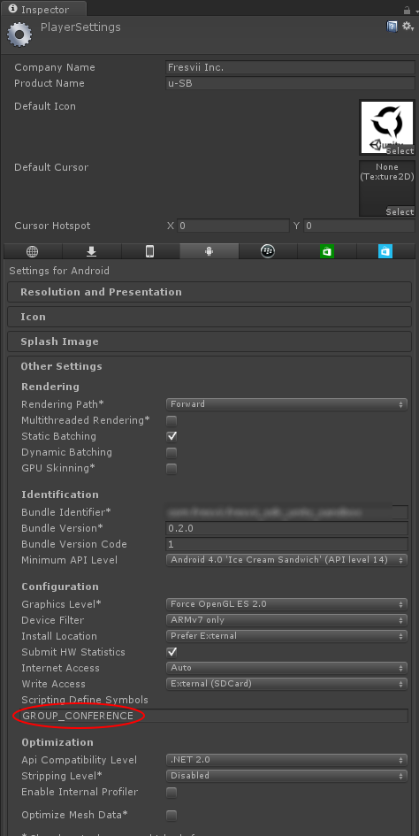

# Use Group Conference (Voice Chat) #

Please follow the steps below to use Group Conference on your app.

You will be able to call GUI for Group Conference and use operation class for Group Conference with the following steps.

### 1. Install the package
To use functions for group conference, you are required to additionally install "appsteroid-unity-with-voicechat-\*.\*.\*.unitypackage". Please refer to GettingStarted for the steps to install. This package contains plugin library for iOS/Android which is required for Group Conference.

### 2. Define Custom Compiler Flag
Define a symbol named "GROUP_CONFERENCE" in `Scripting Define Symbols` under `Other Settings` under `Player Setting`. This will validate the code for group conference.

### 3. For iOS

Add "Security.framework" "libc++.dylib" when on build in Xcode.

To continue VoiceChat even after the app moves to the background, add `UIBackgroundModes` and `App Provides Voice over IP services` to Info.plist. To use this setting, please perform the audio-related processing properly in the app.

 

## Important Notes
### Sleep mode and Voice Chat

Going into sleep mode during voice chat session will result loosing communication to that group. However, as long as that particular session exists, any devices that recovers from sleep mode will automatically participate to that group. If the group dose not exist, those device will automatically end the call.

While the host device is in sleep mode during any Voice Chat session, all members in that group will lose connection for the call. If the host recovers from sleep mode, the session will automatically resume.

To avoid sleep mode ending Voice Chat, please turn off sleep mode within your app's settings.
