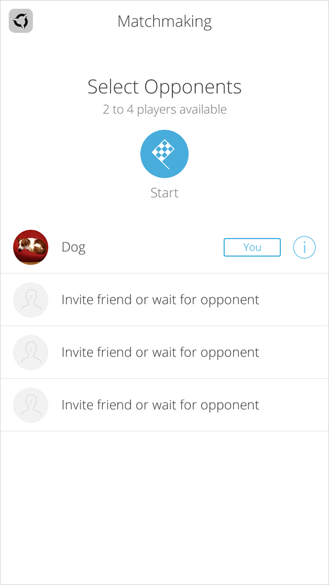

# Matchmaking

----------

### Matchmaking description
- Matchmaking is for finding opponents within the game.
- There are 3 different ways to join a matchmake.

  - **Create a Request:**
  Create a request by specifying conditions for the match. A new match object will be generated when a player select a specific user to invite.  If a player did not specify a user to invite and found a existing match that coincide the specified conditions, it will automatically join to that Match. If there weren't any matches that coincide the conditions, it will generate a new match object and wait for other players to join.

  - **Accept Invitation:**
  Join a match by accepting a matchmake request invitation. It will mainly be used between friends.
    Use the invitation ID (=request ID) to process canceling the invitation once after accepting it.

  - **Join a Match:**
  Select a match ID to join a specific Match.
    If all the players participating to that existing match cancels it, the player can not join to the match.

- After the matchmake was approved, data listed below will be generated for every match.

    - **Group for Matchmake**
  Used for in-game chat and voice chat.

    - **Game Context**
  Used as a shared data for turn basis game.

----------

## Basic Steps for Matchmake

### 1. Matchmaking with AppSteroid GUI

#### Steps
i. Register a event to be called after match completion
ii. Call the matchmaking GUI

	{
		// i.　Register a event to be called after match completion
		FASEvent.OnMatchMakingMatchCompleted += OnMatchMakingMatchCompleted;
		
		// ii.   Call the matchmaking GUI
		FASGui.ShowMatchMakingGui(2, 4, null, null, null, FASMatchMaking.Recipient.Everyone);
	}

	//　Will be called when the matchmake is approved
	void OnMatchMakingMatchCompleted(Fresvii.AppSteroid.Models.Match match)
	{
		//	Process for match object
		//	e.g.
	}

To process the matchmake with AppSteroid GUI, use the method under `FASGui` class of `Fresvii.AppSteroid` namespace.

	public static void ShowMatchMakingGui(uint? minNumberOfPlaysers, uint? maxNumberOfPlaysers, string[] inviteUsers, string invitationMessage, string segment, FASMatchMaking.Recipient recipient)

Check the list below for parameters and argument of the method.

|Name|Type|Description|
|------|------|-----|
|minNumberOfPlaysers|uint?|Minimum participants [2 - 16] Default value on null: 2|
|maxNumberOfPlaysers|uint?|Maximum participants [2 - 16] Default value is same as min_number_of_players on null|
|inviteUsers|string[]|ID list of users to invite. No user to invite on null. **When using AppSteroid GUI, inviteUsers are selected on the GUI, so please select null**|
|invitationMessage|string|Invitation message. null or empty string for no invitation message.|
|segment|string|Use when matching the request that contains this same string. Match filter will not be processed when selecting null or empty string. Developer can make any string name for filtering.|
|recipient|FASMatchMaking.Recipient|Select either { Everyone, FriendOnly } for enum Recipient|

Check the following examples for use of Matchmaking GUI.

#### Example 1
- Matchmake with anyone
- Search between 2 to 4 players

	FASGui.ShowMatchMakingGui(2, 4, null, null, null, FASMatchMaking.Recipient.Everyone);

#### Example 2
- Matchmake only with friend invitation
- Search between 3 to 5 players

	FASGui.ShowMatchMakingGui(3, 5, null, null, null, FASMatchMaking.Recipient.FriendOnly);

#### Example 3
- Start a matchmake with any player who are looking for one with a keyword "Beginner". 
- Search between 2 to 16 players

	FASGui.ShowMatchMakingGui(2, 16, null, null, "Beginner", FASMatchMaking.Recipient.Everyone);

----------

### 2. Matchmaking with coding

#### Preparation
Players are required to login to use Matchmaking.
Please refer to "GattingStarted" document for steps to process user login.

#### Steps

- **Step 1.** Get matchmaking request

- **Step 2.**
  - **Case 1.** When there is an existing matchmaking request: Skip Step 2.
  - **Case 2.** When there isn;t any existing matchmaking request: Create a matchmaking request and move to step 3.

- **Step 3.**  Wait for the match to be approved.
  - **Case 1.** When push notification is valid: Submit the Event, FGCEvent.OnMatchMakingMatchCompleted, and wait for the match to be approved.
  - **Case 2.** When push notification is invalid: Wait for the match to be approved after polling process.

- **Step 4.** Transmit and receive game context (JSON) between players after the match is approved.
  - Send Game context after calling FGCMatchMaking.UpdateGameContext().
  - **Case 1.**
  When push notification is valid: Get game context and execute it, since the event FGCEvent.OnMatchMakingGameContextCreated will  will occur when the game context is created.
  - **Case 2.**
  When push notification is invalid: Get game context using GetGameContext() and execute it by polling process.

- **Step 5.**Destry the match when the match ends.

### Sample code

  using Fresvii.GamingCloud.Models;

  MatchMakingRequest matchMakingRequest;

  void StartMatchMaking()
  {
    //	Register event to get match making information
    FGCEvent.OnMatchMakingMatchCompleted += OnMatchMakingMatchCompleted;

    //	Step 1.  Get a match making request
    FGCMatchMaking.GetMatchMakingRequest(OnGetMatchMakingRequest);
  }

  void OnGetMatchMakingRequest(MatchMakingRequest matchMakingRequest, Error error)
  {
    if (error == null) // Step 2. - Case 1.
    {
      this.matchMakingRequest = matchMakingRequest; // Step 3. Wait for match making being completed
    }
    else // Step 2. - Case 2.
    {
      FGCMatchMaking.CreateMatchMakingRequest(minNumberOfPlayers, maxNumberOfPlayers, inviteUsers, invitationMessage, segment,
        delegate(MatchMakingRequest matchMakingRequest, Error error2){
          if (error2== null)
          {
            this.matchMakingRequest = matchMakingRequest;  // Step 3. Wait for match making being completed
          }
          else
          {
            Debug.LogError("CreateMatchMakingRequest Error : " + error2.ToString());
          }
        });
    }

    //	Step 3. - Case 2.
    StartCoroutine(WaitForMatchMakingComplete());

  }

  IEnumerator WaitForMatchMakingComplete()
  {
    bool polling = true;

    float pollingInterval = 5.0f;

    while(polling)
    {
      // GetMatch
      FGCMatchMaking.GetMatch(matchMakingRequest.Match.Id, delegate(Match match, Error error)
      {
         if (match.Status == Match.Statuses.Complete)
        {
          OnMatchMakingMatchCompleted(match);

          yield break;
        }
      });

      yield return new WaitForSeconds(pollingInterval);
    }
  }

  //------------------------------------------
  //	Step 4
  //------------------------------------------
  void OnMatchMakingMatchCompleted(Match match)
  {
    //================================
    //	Game Loop
    //================================
    //----------------------------------------------------------
    //	Send GameContext (Send json string)
    //----------------------------------------------------------
    //
    //	//	example send float value1 and float value2
    //	Dictionary<string, bool> dictionary = new Dictionary<string, float>();
    //
    //	dictionary.Add("value1", 0.5f);
    //
    //	dictionary.Add("value2", 1.5f);
    //
    //	string json = Json.Serialize(dictionary);
    //
    //	FGCMatchMaking.UpdateGameContext(match.Id, json, delegate(GameContext gameContext, Error error)
    //	{
    //
    //	});
    //
    //----------------------------------------------------------
    //	Get GameContext
    //----------------------------------------------------------
    //
    //	// Step 4 - Case 1  - register event for game context creation
    //	FGCEvent.OnMatchMakingGameContextCreated += OnMatchMakingGameContextCreated
    //
    //	// Step 4 - Case 2 - get game context by polling
    //	while(polling)
    //	{
    //		FGCMatchMaking.GetGameContext(match.Id, delegate(GameContext gameContext, Error error)
    //		{
    //			//	process the gamecontext
    //			IDictionary dictionary = (IDictionary)gameContext.Value;
    //
    //			float value1 = (float)(dictionary["value1"]);
    //
    //			float value2 = (float)(dictionary["value2"]);
    //		});
    //
    //		yield return new WaitForSeconds(pollingInterval);
    //	}
    //
    //================================
    //	End Game
    //================================
    //
    //	// Step 5 - dispose the match
    //	FGCMatchMaking.DisposeMatch(match.Id, delegate(Match match, Error error){
    //	{
    //
    //	});
    //
  }
