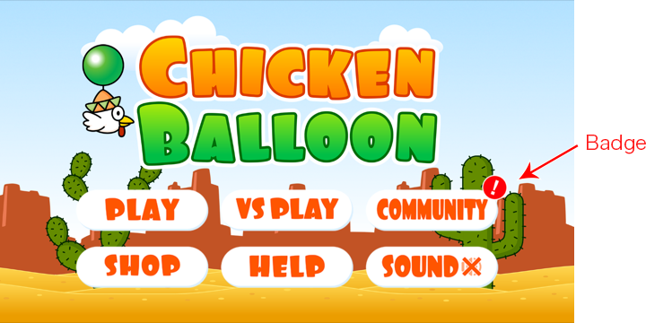

# How to Use Notification Badge on Game Title
last update at　2016/04/21

Developers can show badge count on their game title showing the count of unread notification in AppSteroid.
The badge is prepared as a Prefab **AppSteroidNotificationBadge** (UGUI), so please place it to wherever it is appropriate in the game.

To not use the Prefab, please use the [API to get notification status](Specs/Spec-FASGui.md#FASGui.HasNotifications).

Please feel free to use the texture for badge in the Fresvii/AppSteroid/UI/BadgeTextures folder.
