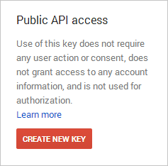
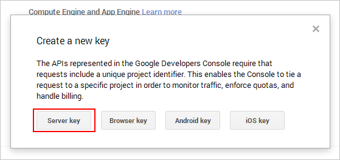
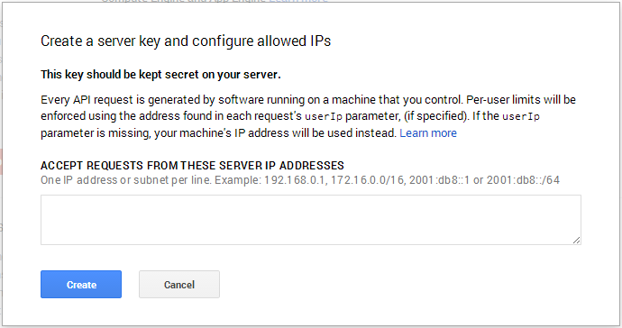
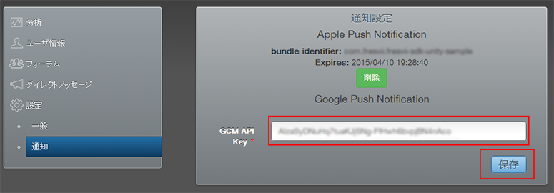
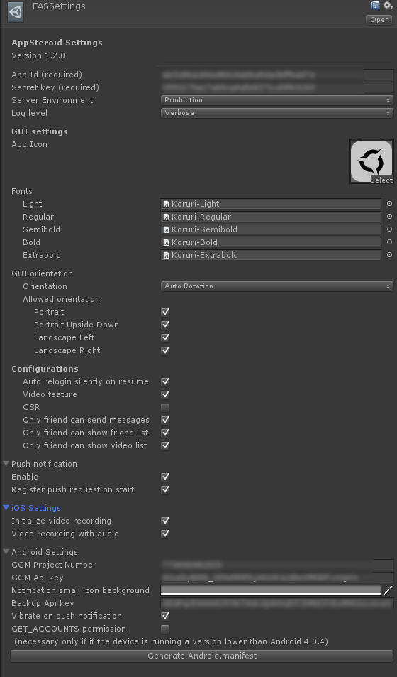

# Setting Push Notification for Android

This document is a full walkthrough for setting up push notification for Android using GCM, "Google Cloud Messaging for Android”.

The guide for setting GCM with Android is broken-down into 5 parts.

1. Get Project Number and API key on your Google Developer Console
2. Setup API key on AppSteroid Web Console
3. Setup Project Number and API key on Unity
4. Setup AndroidManifest file
5. Setup Push notification icon

## 1.   Get Project Number and API key on your Google Developer Console

First, create a new project or select a existing project on [Google Developer Console]"https://console.developers.google.com”.

Now, select **Overview**.

Check the **Project Number** listed above the title in Project Dashboard.

Select **APIs & auth -> APIs** for your project in Google Developer Console.

Make sure the check mark is **on** for Google Cloud Messaging for Android.

Next, select **APIs & auth -> Credentials**.

Click the **CREATE NEW KEY** to generate **Server Key** of API key.

Leave the **ACCEPT REQUESTS FROM THESE SERVER IP ADDRESSES** blank and click **Create** to generate API key.

Check the **API key** that has been generated.

Now you completed to get the Project Number and API key.  You need to set them up on AppSteroid Web Console and Unity application.

## 2. Setup API key on AppSteroid Web Console

Login at [https://fresvii.com/](https://fresvii.com/) and select **Settings->Notification** to setup the GCM API Key you’ve generated on step 1.

## 3. Setup Project Number and API key on Unity

The step from here is same as the step in GettingStarted.
Setup the Project Number and API key with the Inspector in AppSteroid Prefab.

## 4. Setup AndroidManifest file

Please refer to the document, "Setting Up AndroidManifest"

## 5. Setup Push notification icon

Replace "ic_stat_notify.png" and "ic_launcher_notify.png" in Assets/Plugins/Android/res/drawable-*dpi with the same file name and resolution.

"ic_stat_notify.png" will be used for the push icon displaying on the states bar.

"ic_launcher_notify.png" will be used for the push icon displaying on the notification center.

----------
