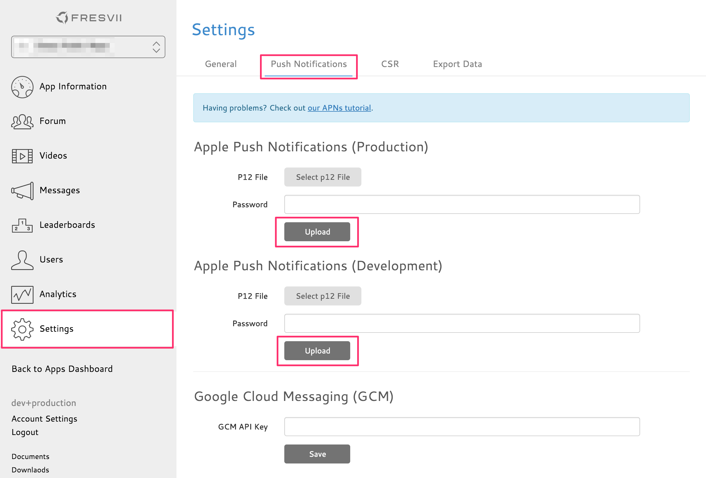

#PushNotification

## How to register a Push Notification certificate
First, download your Push Notification certificate generated on iOS Dev Center.

Register your certificate on KeyChain, which will be registered with the name listed below.
* For Development : Apple Development IOS Push Services: Your.Bundle.ID
* For Production : Apple Production IOS Push Services: Your.Bundle.ID

### How to create a p12 file
Open KeyChain, right click the certificate you’ve registered and select “Export”.

Enter the file name and make sure the file format is "Personal Information Exchange(.p12)” before you “Save” it.

Enter the password and create your p12 file.

### How to upload a p12 file
Login to the console [fresvii](https://fresvii.com/), go to Settings->Notification and upload your p12 file.
Enter the password you’ve previously setup when exporting the p12 file.

After a successful upload, you will see a screen like below.

