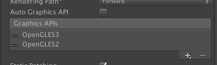

# AppSteroid for Unity に関するよくあるお問い合わせ#

----------

#### Unity の対応バージョンはいくつですか？

AppSteroid が利用している Unity の API の対応バージョンは、4.6.9 以上です。Pro は必要ありません。
Unity 5 用をご利用になる場合は、Unity 5.1.3 以上をご利用ください。
**ただし、2015/10/05 現在の最新版の Unity 5.2.* には既知の問題が多く存在しますので、Unity 5.2.* のご利用はお避けください。**

#### AppSteroid SDKをアップデートするにはどうすればいいですか？
AppSteroidをアップデートする場合は、[SDKのアップデート](AppSteroidSDKのアップデート.md) をご参照ください。

#### GUI表示でテクスチャがぼけて表示されます。どうしたらよいですか？

Unity の"QualitySettings"で、Texture Quality を Full Res にしてください。

#### AppSteroid SDKのアップデートパッケージをインストール後、エラーが出ました。どうしたらよいですか？

AppSteroid SDKのアップデートパッケージをインストール直後にエラーが発生している場合、古いファイルが存在したり、クラスが重複したりしていることが原因と考えられます。
一度、Assets/Fresvii フォルダを削除し、再度 AppSteroid SDKパッケージをインストールしてください。

**Assets/Fresvii フォルダを削除する際、FASSetting の内容も削除されてしまいます**ので、AppID や Secret key, GCM Project Number などの情報は別途控えておいてください。または、`FASSettings.asset` ファイルを別に保存し、パッケージインストール後に上書きしてください。

#### iOS のビルドでエラーが出ます

下記のような `FASGTMHTPFetcher` でエラーの場合、`Enable Objective-C Exception` を `YES` に設定してください。検索窓でexception を入力すると探しやすいです。

#### iOS のビデオ録画が真っ黒なビデオが作成されます。どうしたら良いですか？

現在、AppSteroidでは Open GL ES 3.0 の録画機能に対応しています。
Player Setting -> Other Settings -> Graphics API を Open GL ES 3.0 に設定してください。

- Unity 4.6.7

- Unity 5.1.2

また、Unityでビルド後のXcodeプロジェクトにて、`GLESHelper. mm` ファイルの `CreateSystemRenderingSurfaceGLES` 内の

    [NSNumber numberWithBool:FALSE], kEAGLDrawablePropertyRetainedBacking,

という行を以下のように FALSE -> TRUE に編集してください。

    [NSNumber numberWithBool:TRUE], kEAGLDrawablePropertyRetainedBacking,

#### シーンロード時の画面遷移が遅いのですが、どうすれば良いですか？

AppSteroid for Unityには、シーンロードを高速化するメソッドが入っています。
[FASGui.ShowGUIWithLogin](https://github.com/fresvii/appsteroid-sdk-unity-documents/blob/master/ja/Specs/Spec-FASGui.md#FASGui.ShowGUIWithLogin)をご利用下さい。
また、Unity Pro版をご利用の場合は非同期処理が可能となりますので、画面遷移が高速化されます。

#### AppSteroid のパッケージインストール直後にエラーが出ます。どうしたら良いですか？
**Case 1.** AppSteroid は iOS と Android プラットフォームに対応しています。それ以外のプラットフォーム選択時はエラーが発生する場合があります。ビルド設定を確認し、iOS か Android を選択してください。

**Case 2.** `'Fresvii.AppSteroid.FASConfig' is defined multiple times` もしくは `'FASConfig' could not be found.`のようなエラーが出た場合、ご利用のUnityのバージョンに合っていない AppSteroid SDK をインストールしたことが考えられます。Unity4.6系 と Unity 5系で AppSteroid の SDK は異なりますので正しいパッケージを再度インストールしてください。

**Case 3.** ファイルが不足している、もしくは、クラスが存在しないというようなエラーが出た場合は、パッケージのインポート時に不具合があり、ファイルをインポートに失敗している可能性があります。その場合は、再度パッケージをインストールしてください。

アップデート後にエラーが出た場合は、[SDKのアップデート](AppSteroidSDKのアップデート.md) をご参照ください。

#### <a name="apsanddatabase">- AppSteroidのデータはどこにどのように蓄積されますか？</a>
AppSteroidはAWS上で動作しています。またAPI呼び出しにより作成されたデータはAWS上のデータベースで管理します。
ストレージのようなユーザ固有のデータについては端末側（実装はプラットフォーム毎のSDKに依存）へ保存し、定期的に同期をする事でサーバでも保持されます。これらの永続化されたユーザデータの一部はWebコンソールよりCSVフォーマットでエクスポートする事が可能です。

基本的にAppSteroid利用者の全てのデータは同一のデータベースで管理され、個別データはアプリまたはユーザに紐付ける事でデータの判別を行います。データベースを専用にしたい場合、別途サポートするプランもご用意しています。

#### <a name="commonsystem">- 自社のシステムと共存する場合、どういった形でおこなうべきですか？</a>
AppSteroidのユーザは全体で一意である事が保証されており、IDで特定が可能です。仮に自社システムで管理しているユーザが存在する場合、自社ユーザとAppSteroidユーザ間での関連付けを保持する必要があります。
更にサードパーティ製の他のサービスを利用する場合も考慮すると、いずれかのユーザをマスターユーザとして扱い、それに他のシステムのユーザを紐付ける形で行うのが良いかと考えられます。
仮にAppSteroidユーザをマスターユーザとして扱う場合、自社システムのユーザへのアクセスIDをAppSteroidユーザのストレージへ保存する事でどこからでもアクセスIDを取得可能です。

それぞれのサービスで利用するデータはそれぞれのサービスで保持し、サービス間でデータの連携を行いたい場合は、アプリ内から両サービスのAPI等をそれぞれ呼び出す事で行います。サーバ間で直接やりとりするといったインターフェースは現在のところ提供しておりません。

#### <a name="loadtest">- どの程度までの負荷に耐えられますか？</a>
AppSteroidが提供しているフォーラム機能などのデータについては基本的に無制限に保存する事が可能です。
APIのレスポンス性能については通常のWEBサービスと同様の構成をとっており、アクセスが集中する事により多少性能が低下する事があります。しかし負荷状況を判断し、サーバ側を自動的に増強する事で可能な限り性能の低下を抑えるようにしております。
また、これまでの運用で負荷によるダウン、実用上問題になるレベルでの性能低下は起きておりません。

#### - FASSettings の Server Environemt の切替後、iOS の実機にてログインできなくなりました。どうしたらよいですか？
v.1.0.8 の不具合により、FASSettings ->Server Environemt の Develoment/Production の切替時に iOS の実機にて、ユーザーIDが切り替えられずに、切替後のサーバにログインできない状態となることが確認されています。
この不具合を v.1.0.9 にて修正をしました。異なるサーバ環境におけるユーザーIDの切替は、実行環境にて前回ログインしたサーバ環境が異なる場合に行われます。
このため、Server Environment を切り替えた後に、ログインできない状況になった場合、以前の Server Environment　設定に戻し、端末にて実行後、再度、Server Environment を変更してください。

#### - Android の実機で起動後に下記の Exception が出力されました。どうしたらよいですか？
    NullReferenceException: Object reference not set to an instance of an object
    at Fresvii.AppSteroid.Services.NotificationService.Process () [0x00000] in <filename unknown>:0
    at Fresvii.AppSteroid.FASClient+<UpdateNotification>c__Iterator0.MoveNext () [0x00000] in <filename unknown>:0

既知の問題として、Andoird にてプッシュ通知を利用せず、FASSettingにて、`GCM Project Number` と `GCM Api key` が空の場合に発生することが確認されています。動作上は無視して問題ありません。バージョン 1.0.9 で修正されます。

#### - 下記の Exception が出力されました。どうしたらよいですか？
    NullReferenceException: WWW class has already been disposed.
    Fresvii.AppSteroid.Util.WWWRunner+<DoRequestCoroutine>c__Iterator1B.MoveNext ()

  サーバとの通信がタイムアウトした場合に発生するエラー後、この Exception が発生することが確認されています。
  動作上は無視して問題ありません。バージョン 1.0.9 で修正されます。
  また、Timeout エラーが出力された場合は、実行環境のネットワーク状況を再度ご確認ください。
