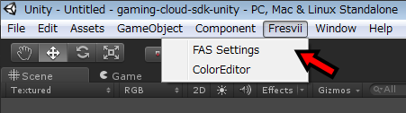
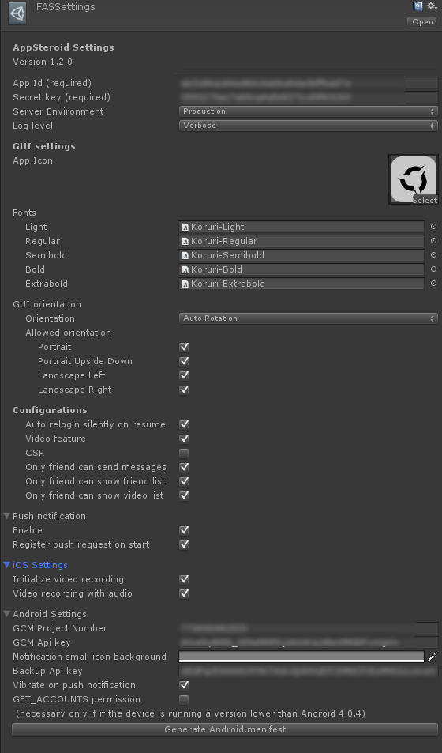

# Getting Started

----------

AppSteroid の新規インストール方法について説明します。AppSteroidをアップデートする場合は、[SDKのアップデート](AppSteroidSDKのアップデート.md) をご参照ください。

1.  FresviiAppSteroid の SDK の Unity Package 「appsteroid-unity-\*.\*.\*.unitypackage」をインポートしてください。 (“Assets” > “Import Package” > “Custom Package...”)

2.  FresviiAppSteroid プレファブをシーンにレイアウトしてください。

3.  メニューの "Fresvii"->"FAS Settings" を選択し、インスペクターで以下のアプリの情報を設定してください。  
AppIdとSecretKeyはWebコンソールより取得できます。詳しくは[Webコンソールでアプリの登録](Webコンソールでアプリ登録.md)を参照してください。

|Data|Type|Description|
|-------|------|-----|
|App Icon|Texture2D|アプリのアイコン画像（AppSteroid GUI で利用）|
|App Id|string|（必須）Fresvii AppSteroid のアプリID|
|Secret key|string|（必須）Fresvii AppSteroid のアプリシークレットキー|
|Server Environment| Production or Development | サーバ環境を選択します。Prodction と Development の２つのデータベースが利用できます。 |

#### AppSteroid GUI settings
|Data|Type|Description|
|-------|------|-----|
|GUI type| enum |Version1 / Legacy から選択します。ただし、Legacy は今後のアップデートはサポートされません。|
|Light font|Font|Light font|
|Regular font|Font|Regular font|
|Semibold font|Font|Semibold font|
|Bold font|Font|Bold font|
|Extrabold font|Font|Extrabold font|
|App Steroid GUI orientation| Orientation |AppSteroid の GUI のデバイスローテーションを設定します。|
|CSR|bool|CSR（Live Help、カスタマーサポート）機能を利用するか、否か|
|Log level|FASSettings.LogLevel|ログ出力レベル。{ Verbose, Warning, Error, None } のいずれかを選択。None の場合も必須のパラメータ入力漏れなどではエラーログ出力します。|
|Auto relogin silently on resume|bool|アプリ再開時に自動で再ログインを行うか、否か。|

#### Push notification
|Data|Type|Description|
|-------|------|-----|
|Enable|bool|プッシュ通知を利用するか否か|
|Register push request on start|bool|プッシュ通知利用の場合、スタート時に自動でプッシュ通知登録を行うか否か|

#### iOS Settings
|Data|Type|Description|
|-------|------|-----|
|Video feature|bool|ビデオの録画、投稿機能を利用するか、否か。ビデオ録画を利用する場合は、Graphic API = Open GL ES 3.0 を選択してください。|
|Initialize video recording|bool|アプリ起動時に自動で初期化処理を行うか、否か。|
|Video recording with audio|bool|アプリ起動時に自動で初期化処理を行う場合、オーディオの録音を行うか、否か。|

#### Android Settings
|Data|Type|Description|
|-------|------|-----|
|GcmProjectNumber|string|Google cloud messaging for Android サービスを利用する場合のプロジェクトナンバー|
|Gcm Api Key|string|Google cloud messaging for Android サービスを利用する場合のAPIキー|
|Notification small icon background|Color|プッシュ通知の小さいアイコンの背景色（Android 5.0 以上の場合に利用）|
|Backup Api Key|string|Google BackupManagerサービスを利用する場合のAPIキー|
|Vibrate on push notification|bool|プッシュ通知着信時ヴァイブレーションを利用するか否か|
|GET_ACCOUNTS permission|bool|Andoid 4.0.4 以下でプッシュ通知を利用する場合チェックが必要。チェックオン時はユーザーのグーグルアカウント取得の許可をユーザーに行う|

1~3の設定後、FAS クラスの各メソッドが利用できるようになります。

4. 「Build Setting」でシーン「AppSteroidUI」をビルドするシーンに追加してください。プラットフォームの設定を iOS または Android に設定してください。

5. ここまで設定できたらまずはサンプルコードを利用してAppSteroidGUIを表示してみてください。利用するコードサンプルは[GUIの表示方法](./ログインからAppSteroidGUIの表示まで.md)を参照してください。  
Unityエディター上で確認ができたら次は各端末ごとの設定を行い、iOS/Androidで表示を行ってみてください。

----------

## 端末ごとの設定

### iOS の場合

FresviiAppSteroid Unity版 SDK の iOS では、キーチェーンにてユーザー情報を保存しています。
そのため、Xcodeでのビルド時は、(Build Phases -> Link Binary With Libraries)にて、「Security.framework」を追加してください。

また、ビデオシェア機能のため「Social.framework」を追加してください。

また、グループカンファレンス機能を利用する場合は、「グループカンファレンス（ボイスチャット）の利用方法」の手順を行い、「libc++.dylib」を追加してください。

Objective-C Exceptions を YES に設定してください。

----------
### Android の場合

#### AndroidManifest の設定

「Android の AndroidManifest の設定」をご参照ください。

#### プッシュ通知アイコンの設定

Assets/Plugins/Android/res/drawable-*dpi フォルダ内の "ic_stat_notify.png" と "ic_launcher_notify.png" を同名、同解像度で上書きしてください。

ステータスバー通知のアイコン(small icon)は "ic_stat_notify.png" が利用されます。

通知センターのランチャーアイコンは "ic_launcher_notify.png" が利用されます。

---

## 機能一覧

AppSteroidSDKの機能一覧は[こちら](機能一覧.md)を参照してください。

## サンプルGUIを表示する

サンプルGUIを利用する場合は、"FresviiSample-uGUI" シーンを開いてください。  
サンプルGUIは各機能の実装方法の参考になります。AppSteroid SDK の機能一覧に関しては[こちら](機能一覧.md)を参照してください。

実行するとコード追加不要でサンプルが利用できるようになります。

「Generate Android.manifest」ボタンを押下すると、Android.manifest　を自動生成します。上書きする場合は、既存の Android.manifest を複製、改名しバックアップをして、新規に Android.manifest が作成されます。
既存の Android.manifest があり、自動生成をしたくない場合は、「Android の AndroidManifest の設定」をご参照の上、手動で編集ください。

実行画面の　“Show AppSteroid GUI” ボタン押下で AppSteroid の GUI が表示されます。

