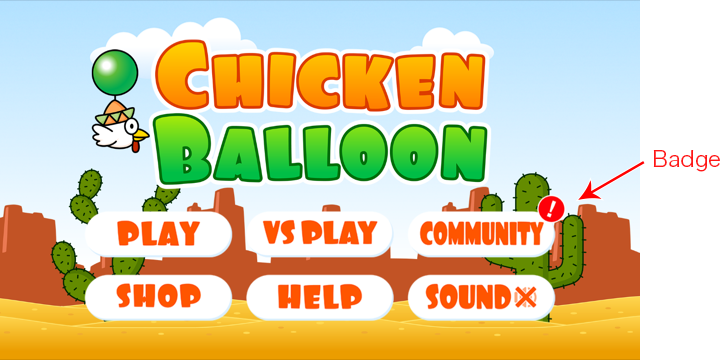

# ゲームタイトルでの通知バッジの利用方法
last update at　2016/04/21

AppSterod　にて何らかの通知があった場合に、ゲームタイトルにバッジを表示することができます。
バッジは UGUI を利用した Prefab **AppSteroidNotificationBadge** として用意されていますので、各ゲームタイトルの任意の箇所に配置してください。

Prefab を利用しない場合は、[通知の有無を取得するAPI](Specs/Spec-FASGui.md#FASGui.HasNotifications)を利用して処理を行ってください。

また、Fresvii/AppSteroid/UI/BadgeTextures フォルダ内にバッジに利用可能なテクスチャが含まれていますので、ご自由にご利用ください。
