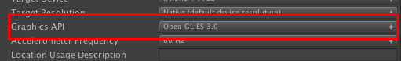
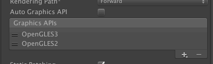

# プレイ動画録画の利用方法
last update at　2015/11/04

----------
以下はビデオ録画機能を利用する場合の設定です。ビデオ録画機能を利用を利用しない場合は下記の対応はすべて不要です。

コード内での各機能の利用については、[Spec-FASPlayVideo](Specs/Spec-FASPlayVideo.md)をご参照ください。

## Graphics API の設定

現在、AppSteroidでは Open GL ES 3.0 の録画機能に対応しています。
Player Setting -> Other Settings -> Graphics API を Open GL ES 3.0 に設定してください。

- Unity 4.6.*

- Unity 5.1.*

## ビルド後の処理

### Unity 4.6.* の場合
Unityでビルド後のXcodeプロジェクトにて、`GLESHelper. mm` ファイルの `CreateSystemRenderingSurfaceGLES` 内の

    [NSNumber numberWithBool:FALSE], kEAGLDrawablePropertyRetainedBacking,

という行を以下のように FALSE -> TRUE に編集してください。

    [NSNumber numberWithBool:TRUE], kEAGLDrawablePropertyRetainedBacking,

### Unity 5.1.* の場合
Unityでビルド後のXcodeプロジェクトにて、`GLESHelper. mm` ファイルの下記の該当箇所を

    if(surface->allowScreenshot && UnityIsCaptureScreenshotRequested())
    {
        GLint targetFB = surface->targetFB ? surface->targetFB : surface->systemFB;
        UnityBindFramebuffer(kReadFramebuffer, targetFB);
        UnityCaptureScreenshot();
    }

下記に書き換えてください。

    if(surface->allowScreenshot)
    {
        GLint targetFB = surface->targetFB ? surface->targetFB : surface->systemFB;
        UnityBindFramebuffer(kReadFramebuffer, targetFB);
        _FASCaptureScreenshot();
        if (UnityIsCaptureScreenshotRequested())
            UnityCaptureScreenshot();
    }

また、`GLESHelper. mm` ファイルに以下を追加してください。

    extern "C" void _FASCaptureScreenshot();

## ビデオ録画機能の初期化について
ビデオ録画機能を利用する前に、[初期化処理](Specs/Spec-FASPlayVideo.md#FASPlayVideo.InitializeRecording)をする必要があります。

また、初期化後、端末を回転した場合、録画が正常に行われなくなります。端末の回転を許可している場合は、端末の回転後の適切なタイミングで録画開始前に初期化を行ってください。また、ビデオ録画中は端末の回転を行わないように設定してください。

初期化処理には多少時間がかかります。そのため、ゲームプレイ中などに初期化を行うと遅延が発生します。適切なタイミングで初期化を行うようにご注意ください。

メニューの Fresvii->FAS Setting で表示されるインスペクターにて、iOS Settings / Initialize video recording をチェック On にしている場合は、アプリ起動時に自動で初期化処理を行います。自動で行いたくない場合は、チェックを Off にしてください。
