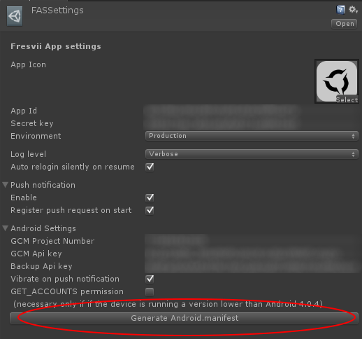

# Android の AndroidManifest の設定

Fresvii AppSteroid の各種機能を利用するために、AndroidManifest.xml ファイルに以下の設定が必要です。

## Manifest ファイルの自動生成

その他のプラグインの利用などにより、独自のマニフェスト設定を行っていない場合は、AndroidManifest を自動生成することが可能です。

Unityのメニューの Fresvii -> FASSettings のインスペクターにて、"Generate Android.manifest" ボタン押下により、　Plugins/Android/AndroidManifest.xml ファイルが生成されます。すでに、同名マニフェストファイルが存在する場合は、同名の旧ファイルは名称を変え同フォルダにバックアップされます。

自動生成時のアプリの Bundle Identifier と FASSettings のパラメータを参照して反映しますので、Bundle Identifier や FASSettings パラメータに変更を加えた場合は、再度　Manifest ファイルを生成してください。

----
# マニュアルによる Manifest ファイルの設定

その他のプラグインの利用などにより、独自のマニフェスト設定を行っており、AndroidManifest を自動生成することができない場合は、AndroidManifest に下記の設定を行ってください。

## Push 通知のための設定

Push 通知を使用するために、以下の XML をAndroidManifest.xml ファイルの application タグ内に追加して下さい。"INPUT_YOUR_BUNDLE_IDENTIFIER" の箇所はご利用になるアプリの bundle Identifier に置換してください。

    <receiver android:name="com.fresvii.sdk.unity.GCMReceiver"
     android:permission="com.google.android.c2dm.permission.SEND" >
        <intent-filter>
            <action android:name="com.google.android.c2dm.intent.RECEIVE" />
            <action android:name="com.google.android.c2dm.intent.REGISTRATION" />
            <category android:name="INPUT_YOUR_BUNDLE_IDENTIFIER" />
        </intent-filter>
    </receiver>

    <service android:name="com.fresvii.sdk.unity.GCMIntentService" />

    <receiver android:name="com.fresvii.sdk.unity.BcReceiver">
      <intent-filter>
        <action android:name="INPUT_YOUR_BUNDLE_IDENTIFIER.NotificationTap" />
      </intent-filter>
    </receiver>

アプリのメインアクティビティの activity タグに以下の XML を追加してください。プッシュ通知の通知をタップしたあと、メインアクティビティを立ち上げるために必要となります。"INPUT_YOUR_BUNDLE_IDENTIFIER" の箇所はご利用になるアプリの bundle Identifier に置換してください。

    <intent-filter>
          <action android:name="INPUT_YOUR_BUNDLE_IDENTIFIER.NotificationAction"/>
          <category android:name="android.intent.category.DEFAULT"/>
    </intent-filter>

アプリのメインアクティビティの　launchMode を "singleTask" にしてください。これはプッシュ通知の通知をタップ後、メインアクティビティの２重起動を防ぐために必要です。

    android:launchMode="singleTask"

## BackupManager のための設定

Fresvii AppSteroid では、ユーザー情報の保存に BackupManager を利用しています。BackupManager を利用することで、Google アカウントに紐付いたアプリケーションのユーザー情報をリストアできるようになります。BackupManager により、アプリケーションの削除後、端末変更後でも同一のユーザー情報を利用可能になります。BackupManager を利用するために下記のサイトにアクセスして、Google の　Android Backup Service　に登録してください。

https://developer.android.com/google/backup/signup.html

登録処理完了後、下記のような XML が取得できます。この XML を AndroidManifest.xml に追加してください。

    <meta-data android:name="com.google.android.backup.api_key"
         android:value="XXXXXXXXXXXXXXXXXXXXXXXXXXXXXX_XXXXXXXXXXXXXXXXX" />

AndroidManifest.xmlの\<application\>タグに、バックアップ関連の属性を追加してください。

    <application
        android:allowBackup="true"
        android:backupAgent="com.fresvii.sdk.unity.TheBackupAgent">

また、すでに BackupManager をご利用されている場合は、SharedPreferences　をバックアップするようにしてください。

## 画像取得、カメラ撮影用 Activity の追加

Fresvii AppSteroid では、フォーラム機能でユーザーのプロフィール写真やゲーム画面の投稿をするために、アルバム内の画像取得やカメラ撮影を利用できます。画像取得、カメラ撮影用アクティビティを利用するために、以下の XML を application タグ内に追加してください。

    <activity android:name="com.fresvii.sdk.unity.ImagePickerActivity"/>

## ビデオ再生用 Activity の追加

Fresvii AppSteroid では、動画再生のために、以下の XML を application タグ内に追加してください。

    <activity android:name="com.fresvii.sdk.unity.VideoPlayerActivity" android:configChanges="orientation|screenSize"/>

## ビデオ録画用 Activity の追加

Fresvii AppSteroid では、ビデオ録画のために、以下の XML を application タグ内に追加してください。

    <activity android:name="com.fresvii.sdk.unity.VideoRecordActivity" android:theme="@android:style/Theme.Translucent.NoTitleBar.Fullscreen" android:configChanges="orientation|screenSize|keyboardHidden" />

AndroidManifest.xmlの\<application\>タグに、メモリ関連の属性を追加してください。

    <application
      android:largeHeap="true" >

## パーミッションの設定

Push通知、画像の読込や保存などを行うために、以下の XML をAndroidManifest.xml ファイルの  application  タグ内に追加して下さい。

    <!-- プッシュ通知を受けるために必要  -->
    <permission android:name="INPUT_YOUR_BUNDLE_IDENTIFIER.permission.C2D_MESSAGE"
            android:protectionLevel="signature" />
    <uses-permission android:name="INPUT_YOUR_BUNDLE_IDENTIFIER.permission.C2D_MESSAGE" />
    <uses-permission android:name="com.google.android.c2dm.permission.RECEIVE" />

    <!-- 端末がスリープ中にプッシュ通知を受けるために必要 -->
    <uses-permission android:name="android.permission.WAKE_LOCK" />

    <!-- （オプション）プッシュ通知用の Google Accout を取得するために必要。ただし、Android 4.0.4 以降は不要 -->
    <uses-permission android:name="android.permission.GET_ACCOUNTS" />

    <!-- （オプション）プッシュ通知受信時にバイブレーションをする場合は必要 -->
    <uses-permission android:name="android.permission.VIBRATE"/>

    <!-- インターネット接続およびインターネット接続状態の取得用 -->
    <uses-permission android:name="android.permission.INTERNET" />
    <uses-permission android:name="android.permission.ACCESS_NETWORK_STATE" />

    <!-- 画像の読込／保存用 -->
    <uses-permission android:name="android.permission.WRITE_EXTERNAL_STORAGE" />
    <uses-permission android:name="android.permission.READ_EXTERNAL_STORAGE" />
    <uses-permission android:name="android.permission.MANAGE_DOCUMENTS" />

    <!-- ビデオ録画用 -->
    <uses-permission android:name="android.permission.RECORD_AUDIO" />

# 一般的な Unity 用の AndroidManifest.xml

Fresvii AppSteroid の機能を利用した一般的な Unity アプリの AndroidManifest.xml　は次のとおりです。INPUT_YOUR_BUNDLE_IDENTIFIER をご利用になるアプリの bundle Identifier に置換してください（6箇所）。
backup.api_key を取得したキー文字列に置換してください。

    <?xml version="1.0" encoding="utf-8"?>

    <manifest xmlns:android="http://schemas.android.com/apk/res/android" package="INPUT_YOUR_BUNDLE_IDENTIFIER" android:installLocation="preferExternal" android:versionCode="1" android:versionName="1.0">

    <supports-screens android:smallScreens="true"
            android:normalScreens="true"
               android:largeScreens="true"
               android:xlargeScreens="true"
               android:anyDensity="true" />

    <permission android:name="INPUT_YOUR_BUNDLE_IDENTIFIER.permission.C2D_MESSAGE"
                android:protectionLevel="signature" />
    <uses-permission android:name="INPUT_YOUR_BUNDLE_IDENTIFIER.permission.C2D_MESSAGE" />
    <uses-permission android:name="com.google.android.c2dm.permission.RECEIVE" />
    <uses-permission android:name="android.permission.WAKE_LOCK" />
    <uses-permission android:name="android.permission.INTERNET" />
    <uses-permission android:name="android.permission.GET_ACCOUNTS" />
    <uses-permission android:name="android.permission.VIBRATE"/>
    <uses-permission android:name="android.permission.ACCESS_NETWORK_STATE" />
    <uses-permission android:name="android.permission.WRITE_EXTERNAL_STORAGE" />
    <uses-permission android:name="android.permission.READ_EXTERNAL_STORAGE" />
    <uses-permission android:name="android.permission.RECORD_AUDIO" />
    <uses-permission android:name="android.permission.MANAGE_DOCUMENTS" />

      <application android:theme="@android:style/Theme.NoTitleBar"
        android:icon="@drawable/app_icon"
        android:label="@string/app_name"
        android:debuggable="true"
        android:largeHeap="true"
        android:allowBackup="true"
        android:backupAgent="com.fresvii.sdk.unity.TheBackupAgent">

      <receiver android:name="com.fresvii.sdk.unity.GCMReceiver"
                  android:permission="com.google.android.c2dm.permission.SEND" >

        <intent-filter>
          <action android:name="com.google.android.c2dm.intent.RECEIVE" />
          <action android:name="com.google.android.c2dm.intent.REGISTRATION" />
          <category android:name="INPUT_YOUR_BUNDLE_IDENTIFIER" />
        </intent-filter>

      </receiver>

      <service android:name="com.fresvii.sdk.unity.GCMIntentService" />

      <receiver android:name="com.fresvii.sdk.unity.BcReceiver">
         <intent-filter>
            <action android:name="com.fresvii.fresvii_sdk_unity_production.NotificationTap" />
         </intent-filter>
      </receiver>

      <meta-data android:name="com.google.android.backup.api_key"
        android:value="XXXXXXXXXXXXXXXXXX_XXXXXXXXXXXXXXXXXX" />

    <!-- Unity 4.6 -->
      <activity android:name="com.unity3d.player.UnityPlayerNativeActivity"
                    android:label="@string/app_name"
                    android:launchMode="singleTask"
                    android:configChanges="fontScale|keyboard|keyboardHidden|locale|mnc|mcc|navigation|orientation|screenLayout|screenSize|smallestScreenSize|uiMode|touchscreen">

    <!-- Unity 5 -->
      <!--
    <activity android:name="com.unity3d.player.UnityPlayerActivity"
                    android:label="@string/app_name"
                    android:launchMode="singleTask"
                    android:configChanges="fontScale|keyboard|keyboardHidden|locale|mnc|mcc|navigation|orientation|screenLayout|screenSize|smallestScreenSize|uiMode|touchscreen">
     -->

        <meta-data android:name="android.app.lib_name" android:value="unity" />

        <meta-data android:name="unityplayer.ForwardNativeEventsToDalvik" android:value="false" />

        <intent-filter>
          <action android:name="android.intent.action.MAIN" />
          <category android:name="android.intent.category.LAUNCHER" />
        </intent-filter>

        <intent-filter>
          <action android:name="INPUT_YOUR_BUNDLE_IDENTIFIER.NotificationAction"/>
          <category android:name="android.intent.category.DEFAULT"/>
        </intent-filter>

      </activity>

      <activity android:name="com.unity3d.player.VideoPlayer"
        android:label="@string/app_name"
        android:configChanges="fontScale|keyboard|keyboardHidden|locale|mnc|mcc|navigation|orientation|screenLayout|screenSize|smallestScreenSize|uiMode|touchscreen">
      </activity>

      <activity android:name="com.fresvii.sdk.unity.ImagePickerActivity"/>
      <activity android:name="com.fresvii.sdk.unity.VideoPlayerActivity" android:configChanges="orientation|screenSize"/>
      <activity android:name="com.fresvii.sdk.unity.VideoRecordActivity" android:theme="@android:style/Theme.Translucent.NoTitleBar.Fullscreen" android:configChanges="orientation|screenSize|keyboardHidden" />

    </application>

    <uses-feature android:glEsVersion="0x00020000" />

    <uses-sdk android:minSdkVersion="10" android:targetSdkVersion="14" />

    </manifest>
