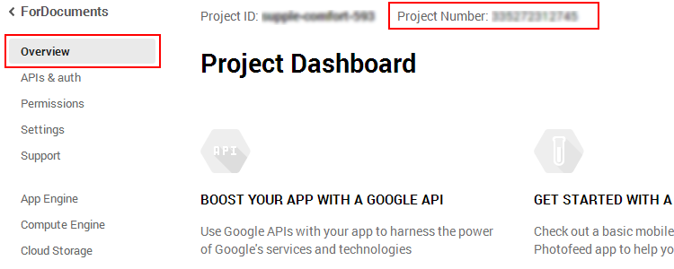
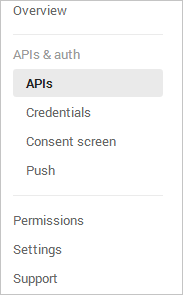
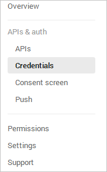
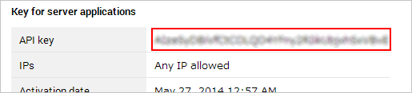
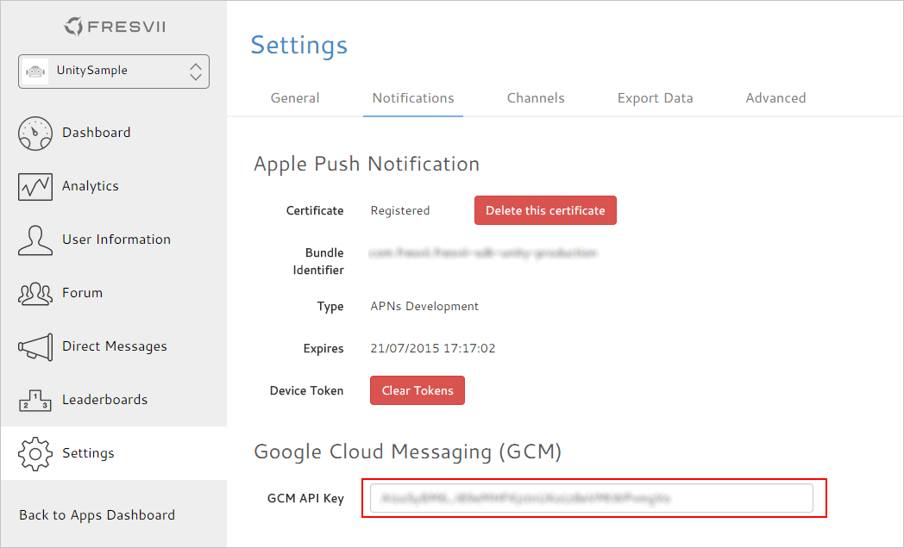

# Android のプッシュ通知の設定方法

GCM(Google Cloud Messaging for Android ）を用いた Android のプッシュ通知設定手順を説明します。

Android での GCM の設定手順は次のとおりです。

1. Google Developer Console で Project Number と API キーを取得
2. Fresvii AppSteroid Web Console で API キーを設定
3. Unity で Project Number と API キーを設定
4. AndroidManifest ファイルの設定
5. プッシュ通知アイコンの設定

## 1.   Google Developer Console で Project Number と API キーを取得

[Google Developer Console](https://console.developers.google.com) にて、新しいプロジェクトを作成、もしくは、既存のプロジェクトを選択します。

**Overview** を選択します。

Project Dashboard のタイトル文字の上に **Project Number** が記載されていますので、数列を確認して下さい。

次に、Google Developer Console の該当プロジェクトにて、**APIs & auth -> APIs** を選択します。

Google Cloud Messaging for Android のチェックを**オン**にしてください。

次に、**APIs & auth -> Credentials** を選択します。

**CREATE NEW KEY**ボタンを押下し、APIキーの **Server Key** を作成します。

**ACCEPT REQUESTS FROM THESE SERVER IP ADDRESSES** は空欄のまま、 **Create** ボタンを押下してAPIキーを作成してください。

作成された **API key** を確認して下さい。

以上で、Project Number と API キーが取得できました。これらを Fresvii AppSteroid Web Console と Unity のアプリに設定します。

## 2. Fresvii AppSteroid Web Console で API キーを設定

[https://fresvii.com/](https://fresvii.com/) にログインし、該当アプリの **設定->通知**　を選択して、1 で確認した GCM API Key を設定してください。

## 3. Unity で Project Number と API キーを設定

ここからの手順は GettingStarted　と同様です。
FresviiAppSteroid プレファブのインスペクターで、Project Number と API キーを設定してください。

## 4. AndroidManifest ファイルの設定

「Android の AndroidManifest の設定」をご参照ください。

## 5. プッシュ通知アイコンの設定

Assets/Plugins/Android/res/drawable-*dpi フォルダ内の "ic_stat_notify.png" と "ic_launcher_notify.png" を同名、同解像度で上書きしてください。

ステータスバー通知のアイコン(small icon)は "ic_stat_notify.png" が利用されます。

通知センターのランチャーアイコンは "ic_launcher_notify.png" が利用されます。

----------
