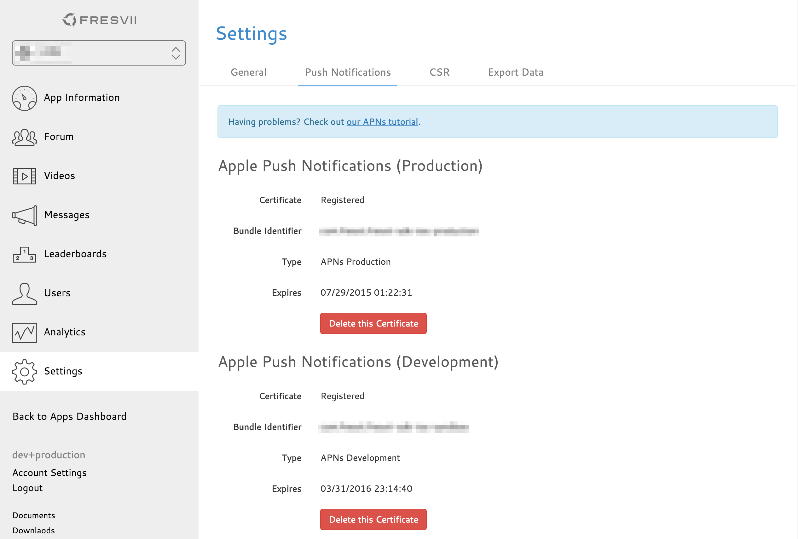

# Push Notificationの設定

## Push通知用証明書の登録
iOS Dev Centerで作成したPush通知用の証明書をダウンロードします。

ダウンロードした証明書をKeyChainに登録します。KeyChainには以下の名前で登録されています。
* 開発用 : Apple Development IOS Push Services: Your.Bundle.ID
* 製品用 : Apple Production IOS Push Services: Your.Bundle.ID

### p12ファイルの作成
KeyChainを開き、先ほど登録した証明書を右クリックして"Export"を選択します。

ファイル名を入力し、ファイルフォーマットが"Personal Information Exchange(.p12)"となっていることを確認して"Save"を押します。

パスワードを入力してp12ファイルを作成します。

### p12ファイルのアップロード
[fresvii](https://fresvii.com/)にログインしてSettings->Notificationより作成したp12ファイルをアップロードします。
p12ファイルを書き出す際にパスワードを設定した場合は"Password"フォームにパスワードを入力してください。

アップロードが完了すると以下の画面になります。

