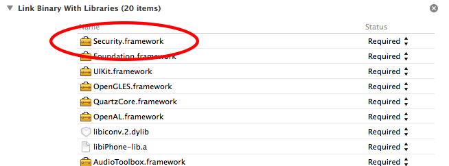
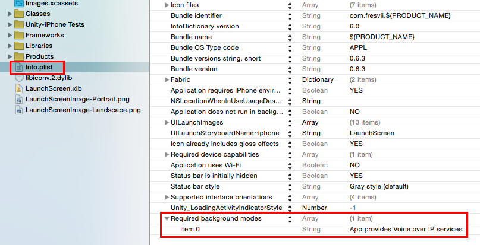

# グループカンファレンス（ボイスチャット）の利用 #

グループカンファレンス機能を利用するには、以下の手順を行ってください。

以下の手順を行うことで、グループカンファレンスを呼び出す GUI や グループカンファレンスの操作用クラス FASConference が利用可能になります。

**グループカンファレンスの利用にはプッシュ通知の設定が必須です。**

**ボイスチャット機能は iOS/Android 端末で動作します。Unity Editor 上の実行ではご利用できませんのでご注意ください。**

### 1. パッケージのインストールする
グループカンファレンス機能を利用するには、 "appsteroid-unity-with-voicechat-\*.\*.\*.unitypackage"をインストールしてください。インストールの手順は、GettingStarted に記載のとおりです。このパッケージには、グループカンファレンスで必要になる iOS / Android のプラグインライブラリが含まれています。

### 2. カスタム コンパイル フラグ を定義する
Player Setting の Other Settings の Scripting Define Symbols に "GROUP_CONFERENCE" というシンボルを定義してください。これにより、グループカンファレンス機能のコードが有効化されます。

### 3. iOS の場合

Xcodeでのビルド時に「Security.framework」「libc++.dylib」を追加してください。

アプリがバックグラウンドに移った場合もボイスチャットを継続する場合は、Info.plist に `UIBackgroundModes` `App Provides Voice over IP services` を追加してください。この設定を行う場合は、アプリで適切にオーディオ関連の処理を行なってください。

